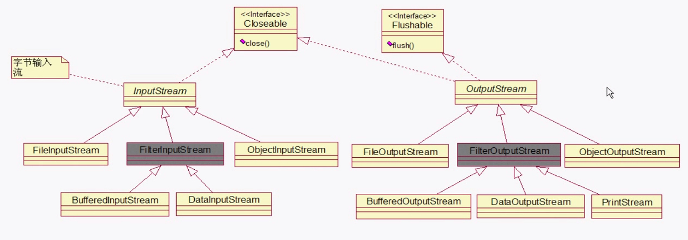

# 分类

- 磁盘操作 -- File
- 字节操作 -- inputStream outputStream
- 字符操作  -- Reader Writer 
- 对象操作 -- serializable
- 网络操作 -- socket

字节uml



字符uml


# 编码解码

- 编码 -- 字符转换成字节
- 解码 -- 反之

## 常用的编码

1. GBK

   中文字符2字节，英文1字节

2. UTF-8

   中文字符3字节，英文1字节

3. UTF-16

   中文英文2字节

   java 的默认采用UTF-16，即char - 两个字节，这是为了：一个中文或英文字符都使用一个char来表示

4. inputStreamReader -- 解码 ； outputStreamWriter -- 编码


# NIO

NIO 面向缓冲区（或通道），io面向流，NIO非阻塞，IO阻塞

- 缓冲区，高效
- 流，慢

NIO组成

- channel ，双向
- buffer
- selector

数据从buffer中写道channel，从channel中读到buffer

channel主要有

- FileChannel   读写文件
- dataGramChannel    UDP 
- SocketChannel TCP
- ServerSocketChannel 传入TCP链接

buffer 主要有,覆盖了基本数据类型（除boolean）

- byreBuffer
- longBuffer
- charBuffer
- doubleBuffer
- floatBuffer
- intBuffer

buffer 的三个量

- capacity -- 容量，通过alocation指定
- limit --  读模式，limit 等于capacity,写模式 limit等于buffer中实际的量
- position ，当前位置

selector 一个线程监听多个管道

```java
// 
Selector selector = Selector.open(); // 打开选择器
ServerSocketChannel ssChannel = ServerSocketChannel.open(); // 打开管道
ssChannel.configureBlocking(false); // 配置为非阻塞
ssChannel.register(selector, SelectionKey.OP_ACCEPT);//注册管道到选择器
int num = selector.selector();  //接受监听，具体根据num来定
```


