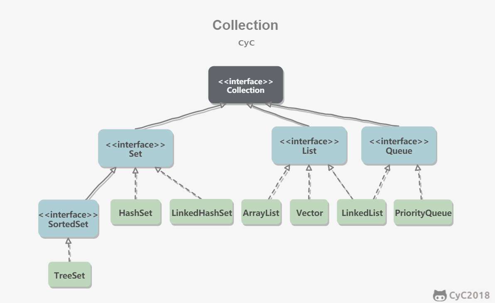

# Java 容器

## 概况

java中的容器有 Collection 和 Map  两种，Collection 是存放对象的集合，Map是存放键值对的映射表


## Collection



1. Set 
   - TreeSet 基于红黑树实现，支持有序性操作（指定一个范围查找元素）,但查找效率不如HashSet.
   - HashSet 基于哈希表实现（HashMap），不支持有序性操作，但查找效率高。
   - LinkedHashSet 基于(继承LinkedHashMap)实现，使用双向链表维护元素顺序，并有HashSet的查找效率
2. List
   - ArrayList 基于动态数组（不指定大小），支持随机访问
   - Vector 和ArrayList类似，线性安全
   - LinkedList  基于双向链表实现，方便插入删除，可以用来实现堆、栈、队列和双向队列
3. Queue
   - PriorityQueue 	基于堆实现，可以用来实现优先队列

## Map


- TreeMap: 基于红黑树实现
- HashMap: 基于哈希表实现
- LinkedHashMap:双向链表维护顺序
- HashTable :线性安全，已遗弃


## 源码

- ArrayList

  实现RandomAccess（标记接口，表示支持随机访问） 接口，数组默认大小是10

  - 扩容（grow），会在所以add 方法中调用检测容量的方法，扩容大小 -- oldCapacity + oldCapacity >> 1,扩容是使用Arrays.copyOf 把原数组复制到新数组中，
  - 删除元素，把 index + 1 的元素，全部复制 index处，时间复杂度 O(n)
  - 序列号，由于动态数组的特性，序列化时不需要全部序列号，ArrayList  实现了ReadObject ， writeObject 方法来控制，序列化数组中元素
  - fail-fast 并发错误，会抛出concurrentModifyException  使用 java.util.concurrent 下的 CopyOnWriteArrayList 替代

- vector

  实现类似ArrayList,方法使用synchronized 同步，性能差，Collections.synchronizedList() 方法（或者 CopyOnWriteArrayList）可以获得一个线性安全的ArrayList，add方法是安全的，但是便利并不安全

  - CopyOnWriteArrayList 读写分离，写加锁，写完后把原始数组指向新的数组

- LinkedList

   ````java
   // Node 节点信息
   private static class Node<E> {
       E item;
       Node<E> next;
       Node<E> prev;
   }
   // 链表保持首尾指针
   public class LinkedList<E>
       extends AbstractSequentialList<E>
       implements List<E>, Deque<E>, Cloneable, java.io.Serializable
   {
    	transent   Node<E> first;
       transent   Node<E> last;
   }
   ````

- ConcurrentHashMap

  1.7采用了分段锁机制（segment），每一个segment维护多个HashEntry.并发度就是segment的个数

  1.8 使用cas + synchronized

- LinkedHashMap

  继承自HashMap,内部维护了一个双向链表

  ```java
  /**
  * The head (eldest) of the doubly linked list.
       */
  transient LinkedHashMap.Entry<K,V> head;
  
  /**
       * The tail (youngest) of the doubly linked list.
       */
  transient LinkedHashMap.Entry<K,V> tail;
  ```

- weakHashMap

   weakHashMap 中的 entry 继承自WeakReference (虚引用),于是WeakHashMap 中的数据会被下一次垃圾回收回收掉

   eg.

    - ConcurrentCache  tomcat 的ConcurrentCache采用分代缓存

      	- 常用的对象放入currentHashMap ,不被回收
         	- 不常用的对象放入WeakHashMap ，会被回收

      调用get 时，先从currentHashMap 中拿，如果没有；则从weakHashMap 中拿，如果有，则放到currentHashMap中，

      调用put时，如果currentHashMap 超过设定容量，则把其中的对象全部转移到weakHashMap

      

