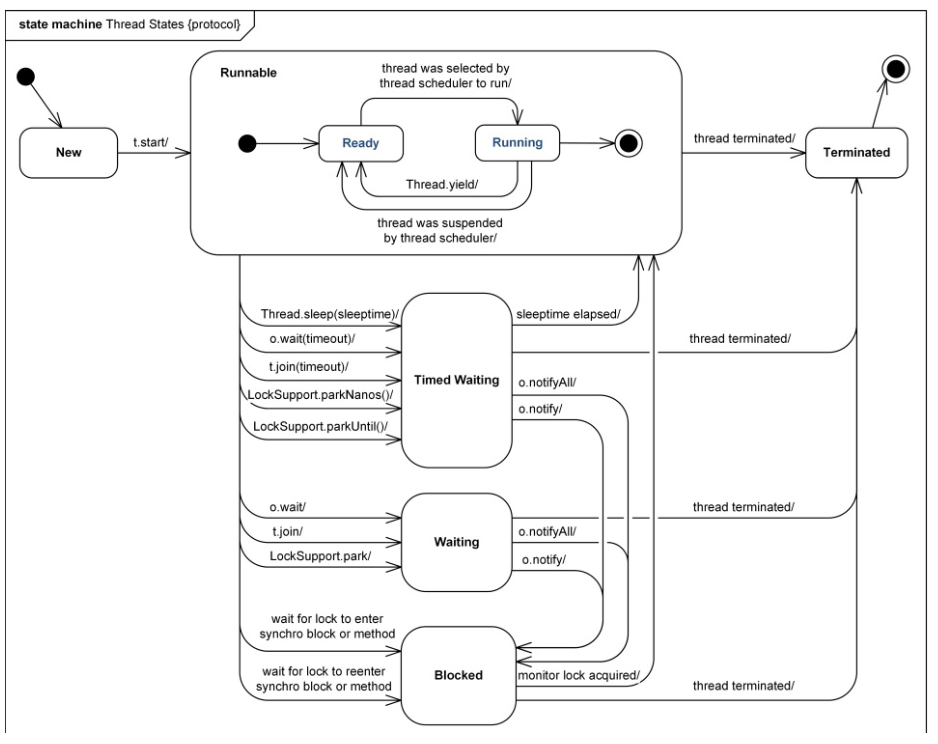
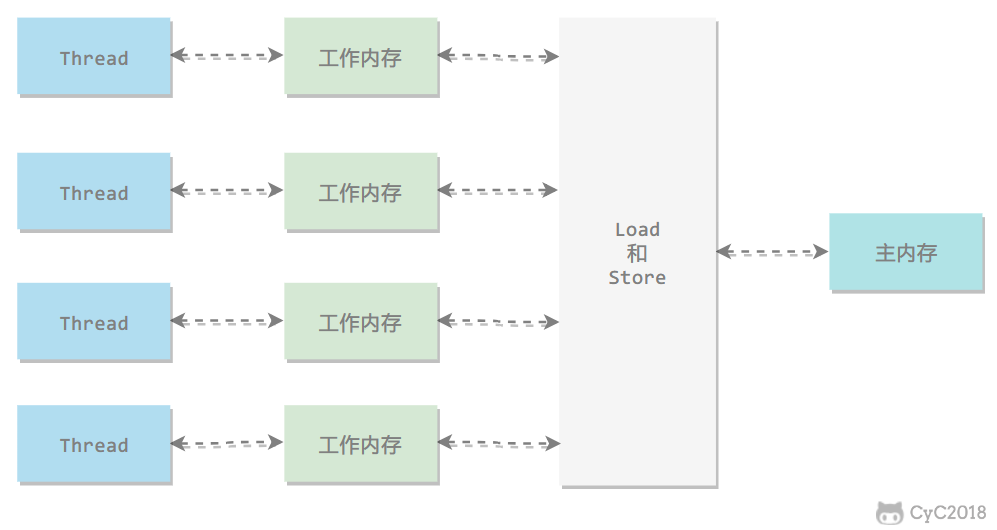

# 使用线程

创建任务

- 实现 Runnable 接口 ，无返回值
- 实现 Callable 接口， 有返回值 ,FutureTask

创建线程

- Thread ,Thread 实现了 runnable 接口


# 基础线程机制

1. Executor

   线程管理类,有三种线程池

   - SingleTheradPool ,  循环使用线程运行任务，相比 Thread 减小了创建销毁线程的消耗
   - FixedThreadPool , 定长线程池
   - CachedThreadPool，变长线程池

2. Daemon 

   main 是非守护进程，使用setDaemon可以设置守护进程

   ```java
   public static void main(String[] args) {
       Thread thread = new Thread(new MyRunnable());
       thread.setDaemon(true);
   }
   ```

   

3. sleep()

   线程休眠，会抛出 InterrupteException ,并且由于不能跨线程传播到 main() 中，所以需要在当前线程中处理

4. yield()

   Thread.yield() 表示当前线程已经执行完最重要的部分，可以将cpu资源让给其他线程，是线程对调度器的一个建议


# 中断

线程结束有三种情况

- 线程执行完毕
- 线程被打断(抛出异常)

 ## interruptedException

当线程处于 阻塞、限期等待或无限期等待时，可以被 Thread.interrupt 打断，但 IO阻塞 和synchronized 锁除外

```java
// run 方法中
try {
    Thread.sleep(2000);
} catch (InterruptedException e) {
    e.printStackTrace();
}

// main 中
thread1.start();
thread1.interrupt();
```

如果线程没有上诉状态，此时要想打断线程，调用interrupt()

```java
//调用线程的interrupt() 方法会给线程设置中断标志--interrupted() 返回true
while (!interrupted){
    ///
}
```

- isInterrupted()

此方法只会读取线程的中断标志位，并不会重置。

- interrupted()

此方法读取线程的中断标志位，并会重置。

- throw InterruptException

抛出该异常的同时，会重置中断标志位。

## Exector 的中断

- shutdown() 等待线程执行完才关闭 ，并且不能再提交任务
- shutdownNow() 相当于对每一个线程调用 interrupt() ，并且不能再提交任务
- Future.cancle(true) 单独关闭某个线程，需要Callable 并且包含 Future 返回值的方式


# 互斥同步

## synchronized ReentrantLock

区别

1. synchronized jvm实现 ，ReentrantLock jdk 实现

2. ReentrantLock 可以添加条件，synchronized 不能

   ```java
   ReentrantLock lock  = new ReentrantLock();
   Condition condition = lock.newCondition();
   try {
       condition.await();
   } catch (InterruptedException e) {
       e.printStackTrace();
   }
   condition.signal();
   ```

   

3. ReentrantLock  等待可中断 -- tryLock ，synchronized 不可

4. synchronized 非公平锁 ， ReentrantLock 可实现公平锁 ，构造器 传入 true

5. synchronized 锁的是对象， ReentrantLock 锁的是线程


# 线程之间的协作

- join   a.join() 当前线程等待，等待a线程执行完，继续执行当前线程

- ### wait() notify() notifyAll() ， 输入Object 范畴，会释放锁

- ### await() signal() signalAll() ， java.util.concurrent 包下condition 提供的方法，比起 wait 等，可以更加精准的阻塞\唤醒线程，而 wait是随机的

- LockSupport 线程工具类,区别于wait / notify ，park 不需要获取锁对象即可锁住线程，可以唤醒指定线程

  ```java
  // run 方法中
  LockSupport.park();
  
  // 唤醒
  LockSupport.unpark(线程名);
  ```

  

# 线程状态

  

  

  - 新建 -- new

    创建一个线程实例，未 start

  - 可运行 -- runnable

    java 没有running 状态，runnable包含了操作系统的 ready 、 running 、blocked三种状态, java 虚拟机并不关心操作系统的状态，只要拿不到资源（cpu、IO等），都认为是runnable状态

  - 阻塞 -- blocked 

    有 synchronized 锁而导致进入的状态

  - 无限期等待 -- waiting

    等待其他线程显示唤醒

  - 限期等待 -- timed_waiting

    无需其他线程显示唤醒

  - 终止 -- terminated  ,该状态调用 start() ,会抛IllegalThreadStateException

  

# JUC

## AQS

  1. 概述

     

  

  abstractQueuedSynchronizer 维护了一个 volatile  int state (线程状态),和一个线程队列。除synchronized 之外的锁机制

  1. state 的访问方式有三种

      - setState
      - getState
      - compareAndSetState

  2. AQS 定义了两种资源访问方式

      - exclusive ,  独占式，例如 reentranLock
      - share , 共享式，如 semaphore, countDownLatch 

  3. 自定义同步器主要实现以下方法

      - tryAcquire(int )/tryRelease(int), 独占式获取/释放资源
      - tryAcquireShared(int)/tryReleaseShared(int), 共享式获取/释放资源
      - isHeldExclusively(), 是否正在独享资源，只有需要用到condition 时才需要实现该方法

      以上方法都是非抽象方法，选择性实现，还有同时拥有共享式和独占式的同步器，ReentrantReadWriteLock

  4. waitStatus, 节点(线程)状态

      - cancled -- 1   , 当前节点取消调度，timeout 或 被中断 后会进入此状态
      - single -- -1 ，当前节点执行完，会唤醒后继节点；节点入队时，会将前继节点更新为 single
      - condition -- -2 ,  节点在等待 condition 
      - propagate -- -3 ， 共享模式下，前继节点会唤醒后续多个节点
      - 0 ， 新节点入队时默认值

      负值表示节点处于有效状态

  5. tryAcquire流程

      ```java
      // 独占式获取资源
      // tryAcquire()(空方法，需要子类实现)尝试获取资源，成功则直接放回，失败则进入 acquireQueued(addWaiter())，addwaiter 把节点加入队尾，并返回节点；
      //acquireQueued() 作用是找到一个安全的休息点: 1.前驱节点是正常的。 2. 前驱节点会唤醒当前节点
      public final void acquire(int arg) {
          if (!tryAcquire(arg) &&
              acquireQueued(addWaiter(Node.EXCLUSIVE), arg))
              selfInterrupt();
      }
      // shouldParkAfterFailedAcquire 作用是找到一个安全的休息点: 1.前驱节点是正常的。 2. 前驱节点会唤醒当前节点 (single)
      final boolean acquireQueued(final Node node, int arg) {
          boolean failed = true; // 获取资源是否失败
          try {
              boolean interrupted = false; // 是否被打断
              for (;;) {  // shouldParkAfterFailedAcquire 中调用park 让线程处于等待状态，当其他线程调用unpark 或者被打断时，再次执行循环
                  final Node p = node.predecessor(); // 前驱节点
                  if (p == head && tryAcquire(arg)) { // 前驱节点是head，head是个傀儡节点，所以判断当前节点是第二个节点时就获取资源，并把前驱节点的指针设为null
                      setHead(node);
                      p.next = null; // help GC
                      failed = false;
                      return interrupted;   // 循环唯一出口
                  }
                  if (shouldParkAfterFailedAcquire(p, node) &&   // 资源释放后，线程被唤醒，进入到此处
                      parkAndCheckInterrupt())
                      interrupted = true;
              }
          } finally {
              if (failed)
                  cancelAcquire(node);
          }
      }
      
      ```

      线程调用tryAcquire获取资源，请求失败则入队尾，并找到一个安全的休息点，等待被唤醒，并再次尝试获取资源，直到获取成功，

      
      
   6. release 流程

      ```java
      
      public final boolean release(int arg) {
          if (tryRelease(arg)) {   // 释放资源成功
              Node h = head;    // 找到 head 节点 
              if (h != null && h.waitStatus != 0)
                  unparkSuccessor(h);
              return true;
          }
          return false;
      }
      
      private void unparkSuccessor(Node node) {
          int ws = node.waitStatus;
          if (ws < 0)  // 置零当前线程的state
              compareAndSetWaitStatus(node, ws, 0);
          Node s = node.next;
          if (s == null || s.waitStatus > 0) { // 下一节点无效
              s = null;
              for (Node t = tail; t != null && t != node; t = t.prev) // 从队列从后往前找，找到最考前的有效节点
                  if (t.waitStatus <= 0)
                      s = t;
          }
          if (s != null)
              LockSupport.unpark(s.thread); // 唤醒该节点
      }
      ```

      释放资源成功后，唤醒下一节点

  7. acquireShared 流程

      ```java
      public final void acquireShared(int arg) {
          if (tryAcquireShared(arg) < 0) // 小于零--失败，等于零--成功但没有剩余资源，大于零--成功且有剩余资源(其他线程也可以获取)
              doAcquireShared(arg);
      }
      ```

      doAcquireShared() 流程和独占式类似，只是才设置当前节点为头节点（即获取到资源）时，也会唤醒后继节点

## countDownLatch

共享式同步控制器

作用

- 让多个线程等待
- 让单个线程等待

  场景

- 多个线程等待，然后并发执行

  ```java
  final int count = 1;
  CountDownLatch downLatch = new CountDownLatch(count);
  for ( int x = 0; x < count << 2; x++){
      exec.execute(() -> {
          try {
              downLatch.await();
              System.out.println(Thread.currentThread().getName() + ":time---" + System.currentTimeMillis());
          } catch (InterruptedException e) {
              e.printStackTrace();
          }
      });
  }
  try {
      System.out.println(System.currentTimeMillis());
      Thread.sleep(1000);
      downLatch.countDown();
  } catch (InterruptedException e) {
      e.printStackTrace();
  }
  ```

  

- 单个线程等待，作为合并、收尾工作

  ```java
  // main 线程 调用了await，需要exec中的线程执行完，调用countDown()，计数器减1；count 减为0后，才会执行
  CountDownLatch downLatch = new CountDownLatch(count);
  for ( int x = 0; x < count; x++){
      exec.execute(() -> {
          System.out.println(Thread.currentThread().getName() + ":time---" + System.currentTimeMillis());
          downLatch.countDown();
      });
  }
  try {
      downLatch.await();
      System.out.println(System.currentTimeMillis());
  } catch (InterruptedException e) {
      e.printStackTrace();
  }
  ```


## cyclicBarrier

到达了指定线程数后，同时执行

```java
// 调用await(),计数器减1
CyclicBarrier cyclicBarrier = new CyclicBarrier(10);
for (int i = 0 ; i< 9; i++){
    exec.execute(() -> {
        try {
            cyclicBarrier.await();
            System.out.println(Thread.currentThread().getName() + "--time:" + System.currentTimeMillis());
        } catch (InterruptedException | BrokenBarrierException e) {
            e.printStackTrace();
        }
    });
}
Thread.sleep(2000);
exec.execute(() -> {
    try {
        cyclicBarrier.await();
        System.out.println(Thread.currentThread().getName() + "--time:" + System.currentTimeMillis());
    } catch (InterruptedException | BrokenBarrierException e) {
        e.printStackTrace();
    }
});
```

## semaphore

控制共享资源的并发量

```java
// 总共 totalRequire 个请求,并发量为 100
int clientCount = 100;
int totalRequire = 1000000;
Semaphore semaphore = new Semaphore(100);
for ( int i = 0; i< totalRequire; i++){
    exec.execute(() -> {
        try {
            semaphore.acquire();
            System.out.println(Thread.currentThread().getName() + " -- " + semaphore.availablePermits());
        } catch (InterruptedException e) {
            e.printStackTrace();
        } finally {
            semaphore.release();
        }
    });
}
```

## 其他组件

1. FutureTask

   实现自runnableFuture接口，而runnableFuture 继承自runnable和Future,所以FutureTask既可以作为任务，又有返回值

2. blockingQueue

   FIFO 队列

   1. LinkedBlockingQueue
   2. arrayBlockingQueue (定长)

   优先队列

   1. priorityBlockingQueue

   提供take() 、put() 方法, 当队列为空take() 阻塞,队列满put()阻塞，直到队列不为空/不满时才不阻塞,add(),remove() 则抛出异常，不阻塞

   ```java
   // priorityBlockingQueue 排序有三种方式
   // 1. 自然排序。 2.对象实现comparator 接口。 3.构造器传入 comparator 实现
   PriorityBlockingQueue queue = new PriorityBlockingQueue(5, new Comparator<Persion>() {
       @Override
       public int compare(Persion o1, Persion o2) {
           return o1.id - o2.id;
       }
   });
   ```

   


# 内存模型

##  概述



工作内存位于高速缓存中，工作内存中都保存了该线程使用到的主内存中的变量副本


java定义了8个指令，用作主内存和工作内存的交互操作

- read  -- 从主内存中读取变量
- load  -- 把read 的变量存放到工作内存
- use  -- 把工作内存的变量传输给执行引擎
- assign -- 把执行引擎的结果传输给工作内存
- store -- 把工作内存的变量传输给主内存
- write -- 把store 过来的变量写入主内存
- lock -- 给主内存的变量加锁
- unlock -- lock 反操作

##  三大特性

1. 原子性

   java 虚拟机保证以上8个指令的操作具有原子性，例子如下:

   1. T2线程在 load cnt 时，T1线程未store到主内存，导致T2拿到了旧值

   

   2. 原子类可以保证相关类型的修改具有原子性

      

      特殊情况：java 允许将64 位类型，分作两次32 位来操作(字分裂)，这样一来，8个执行也没有了原子性。需要 volatile 修饰才保证

2. 可见性

   可见性指某个线程修改的值对于其他线程能看到修改，实现方式

   1. volatile ，变量的原子操作会被刷新到主存上，同步和原子类同理；取消字分裂（64位数据类型的写入分为两个32位）优化
   2. synchronized , 对一个变量执行unlock 之前，必须要等线程把变量store会主内存
   3. final ，被final 修饰的字段在不发生this逃逸(对象初始化未完成，this 引用被其他线程捕获)的时候，具有可见性

3. 有序性

   本线程内观察，所有操作都是有序的；在一个线程中观察另外的线程，操作是无序的，指令重排序导致

   - volatile ，添加了内存屏障，保证重排序的时候，先于volatile变量的操作都在volatile读写之前发生，后于volatile变量的读写都在其之后发生
   
     ```java
     //x,y 可以重排序，但都会在volatile之前，xx，yy也可以重排序，但都需要到volatile之后
     int x = 5;
     int y = 6;
     volatile = 6;
     int xx = 6;
     int yy =7;
     ```
   
     
   
   - synchronized ， 实际上是让单个线程执行代码


# 线程安全

### 不可变

如果共享变量是不可变的，那么就意味着安全。不可变类型有

1. final 修饰的基本数据类型

2. String ,因为string 是不可变的，如果修改了String,只是新生成了一个String ，原来的还是原来的，而Java的引用传递机制导致原来的引用指向地址不会被改变

3. 枚举

4. 部分Number 子类， double 、long （包装类型）

5. Collections.unmodifiableXXX(),可返回对应不可变类型

   

### 互斥同步

synchronizrd reentrainlock

### 非阻塞同步

乐观锁

1. CAS ， 需要三个操作数，旧的期望值A 、新值B、内存地址V，当的值等于A，才将V的值更新为B，如果冲突，则反复重试

   原子类的相关方法调用了unsafe类的方法，unsafe类中有直接与内存打交道的方法，其中大量使用到了CAS

2. ABA，即V的值被改为了B，后又改为了A，CAS认为没有改变。大多数情况下，ABA不影响多线程程序的正确性；J.U.C包中的AtomicStampReference 通过控制变量值的版本号来解决这个问题，但是通常这种情况下，使用互斥同步更高效

### 无需同步

没有共享数据，就不需要同步

- 栈私有，局部变量输入栈私有，不需要同步

- ThreadLocal, 每个线程对数据的拷贝，所以在线程之间是私有的,应对场景是可以把共享数据的作用于限制在一个线程内，即不同的线程拥有的数据是不同的，并且不需要通信。例如 "一个请求对应一个服务器线程"

  ```java
  // 创建ThreadLocal 实例（自带一个ThreadLocalMap字段），然后使用set 方法
  public void set(T value) {
      Thread t = Thread.currentThread();
      ThreadLocalMap map = getMap(t);
      if (map != null)
          map.set(this, value);
      else
          createMap(t, value);
  }
  
  ```

  

# synchronize 锁优化


## 自旋锁

线程在获取共享资源的时候，进行忙循环（自选）一段时间，如果这段时间能获取到资源，就不用进入阻塞状态。但需要占用cpu资源；所以，自旋锁适用于共享数据锁定状态持续时间短的场景

- 自适应自旋锁 -- jdk1.6引入，循环次数不在固定，而是由上一次在同一个锁上的自旋次数有关（计算大致锁定状态持续的时间）

## 锁消除

逃逸分析中，如果共享资源不会逃逸出去被其他线程访问，就可以把他们的锁进行消除，当成私有数据


## 锁粗化

如果一些零碎的操作都在对一个对象反复加锁/释放锁，那么就把锁加到这些操作的外面，减少加锁/释放锁的重复操作


## 偏向锁

偏向锁倾向于把锁给第一个访问的线程，如果该线程第二次访问，就直接把锁给他，提高性能；如果访问的是另一个线程，偏向锁状态结束。


## 轻量级锁 重量级锁

通过CAS操作获取对象的锁，重量级锁使用互斥获取锁


