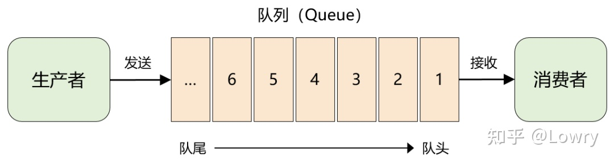
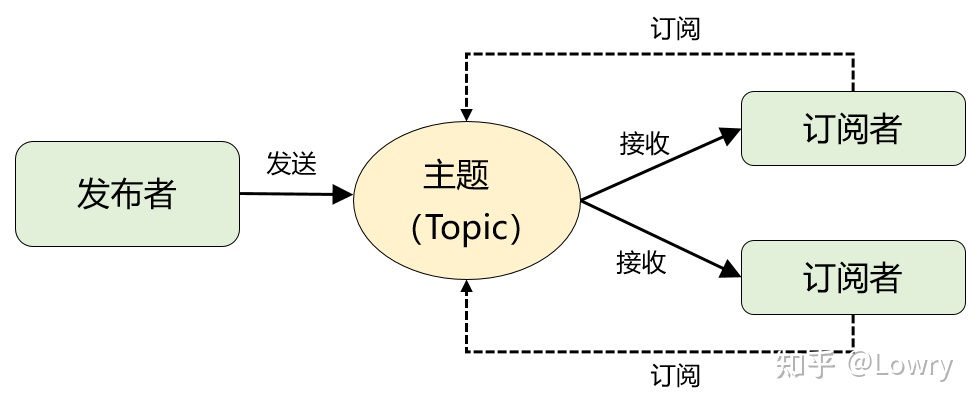
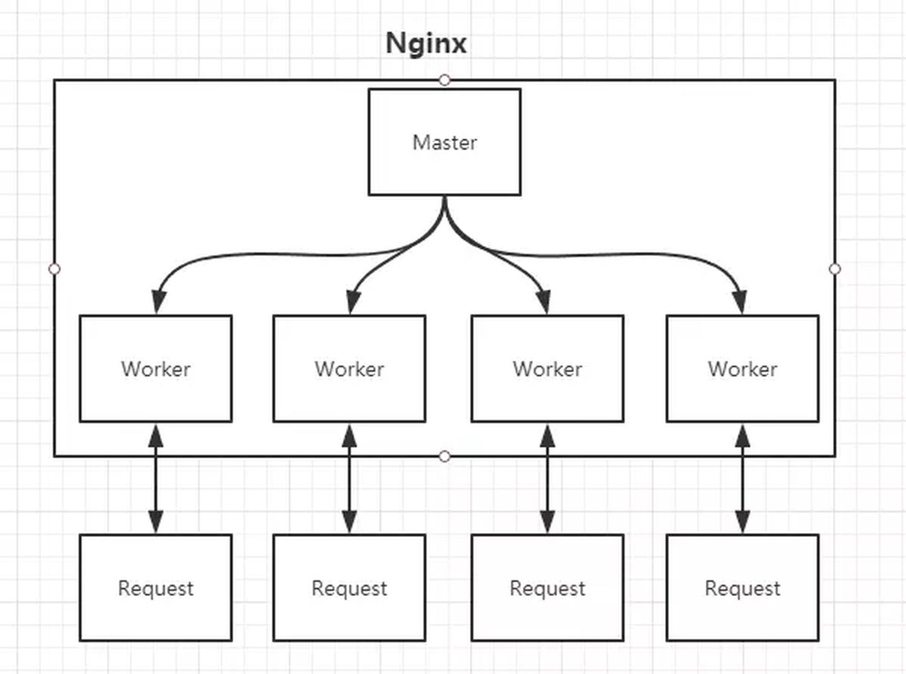

# redis

## 基本命令

### 全局

- keys 遍历所有的key

- dbsize -- key 总数

  

### key

- del key
- dump key -- 序列化key
- exists key -- 是否存在
- persist key -- 永久有效
- expire key  second 
- ttl key -- 查看key 是否过期
- rename key new_key
- get mget -- 批量
- set mset
- strlen key  -- 获取长度


### hash

- hset/hmset key field

- hget key field

- hgetall key -- 获取所有field 和 value

  ```java
  hset user name "solo" age "18"
  hgetall user
  hget user name
  ```

- hdel key field [field]
- hkeys key -- 获取所有field
- hvals key -- 获取所有value


### list

- rpush/lpush  key value [value]右边/左边添加
- linsert key before/after key1 value -- 在 key1 后/前面添加
- lrange key start end(0  -1) -- 从start 到  end 获取 key的元素 ,如果是 0  -1 表面获取所有元素
- lindex key index 获取指定下标元素
- llen key -- 元素个数
- rpop/lpop key   右侧/左侧弹出元素
- lrem key count value 删除
- lset key index new value 修改


### set

- sadd key element [element]
- srem key element[element]
- scard key -- set 个数
- spop key [count] -- 随机弹出元素
- smember key -- 获取所有元素
- sinter key [key]  -- 交集
- sunion key [key] -- 并集
- sdiff key [key] -- 差集

### zset

- zadd key score member [score member]
- zcard key 
- zscore key   member -- 成员分数
- zrank key member -- 排名 
- zrem key member []
- zincrby key increment member -- 增加分数
- zrange key min max / start end  -- 返回指定范围(分数/排名)的成员
- zcount key min max -- 指定范围的成员个数
- zremrangebyrank / zremrangebyscore key min max

### 事务

- multi -- 标记事务开始
- exec -- 标记事务结束,事务内的语句开始执行
- watch key [key] 监视key ,如果被监视的key在事务中被其他命令改变，事务取消
- unwatch 取消所有监视
- discard 取消事务

## 单线程

1. 没有必要多线程，因为多线程是为了充分使用cpu，但是缓存的瓶颈在于内存。
2. 单线程容易维护

## 持久化

1. RDB 全量备份

   定时另起一个进程把数据以快照的形式写入rbd文件，触发方式

   1. save 命令 阻塞当前的redis 读写线程
   2. bgsave 命令
   3. 到时自动出发

2. AOF 日志记录方式

   aof 会把每一条写命令写入文件

   - bgrewriteaof 重写aof文件(覆盖)

   出发机制

   - always ，每执行一条写命令就写文件
   - everysec ， 每秒，异步

3. 比较
   1. RDB 恢复快
   2. AOF更安全


## 过期删除策略

2. 惰性，只有当访问一个key的时候在指定它是否过期，但是如果一直没有访问，就可能导致内存膨胀
3. 定期，定时扫描 expires 字典中一定数量 key，然后清除过期的key


## 内存淘汰机制

当达到max-memory 阈值

- volatile-lru  -- 过期 key 中淘汰最近最少使用的key
- allkeys-lru    -- 在所有key中淘汰最近最少使用的key
- allkeys-random  -- 随机
- volatile-random --随机
- volatile-ttl -- 设置了过期时间的key中，淘汰过期时间更早的key
- noeviction -- 不淘汰，写操作报错

内存淘汰机制针对内存不足的时候，如果内存足够，有key过期，会使用键过期删除策略腾出空间

## 读写分离

一主多从，主节点负责写，从节点负责读

原理

1. 当启动一个 slave node 时，他会发送一个PSYN命令到master node
2. 如果slave 是第一次连接，会出发 全量复制，master 会另起一个线程生成 rdb 快照，同时把收到的写命令缓存起来
3. 把rdb 快照发送给 slave，slave写入磁盘，然后加载到内存。
4. 把缓存的命令发给slave 进行同步
5. 如果是重连， 仅仅复制 slave 缺少的数据
6. 之后，master 接受到的写命令都会发给 slave，保持数据一致性 (增量复制)

如果网络断开 会先进行增量复制，主从各维护一个缓冲区偏移量，偏移量之差就是未同步的数据(延迟量)，如果偏移量的缓冲区满了，就需要进行全量同步


## CAP 理论

- C  consistent  一致性
- A avilability 可用性
- P partition tolerance 分区容忍性

对应 Redis 数据同步而言，假设主从网络断开，如果是读写分离，那么主从节点无法继续同步数据。如果要提供服务(高可用性),数据一致性就无法保证；如果要保证数据一致性，那么就无法提供服务。

在P的影响下，C 和 A 无法兼顾


## 集群

### 哨兵模式

主从复制需要人工恢复

作用

1. 监控节点是否正常运行
2. 当主节点发生故障自动将从节点切换为主节点

配置：只需要配置主数据库的哨兵信息 sentinel.conf-- 名称 ip 端口 最低投票数

1. 每十秒钟哨兵向主从数据库发送 info 命令
2. 每一秒钟哨兵向主从数据库发送ping 命令 -- down-after-milliseconds 
3. 每2秒钟哨兵向主从数据库的_sentinel_:hello 频道发送自己的信息 -- 与其他哨兵通信
4. 当超过 down-after-millisecond ，被ping 的数据库依然没有恢复，则该哨兵认为该数据库主观下线，然后发布信息到sentinel:hello 频道，其他哨兵接受到消息后，ping 该数据库，如果超过最低投票数的哨兵都认为主观下线，那么该数据库就客观下线了
5. 客观下线后，选举领头节点对数据库进行故障恢复
6. 选择数据库依据
   1. 优先级最高   -- replica-prority
   2. 复制越完整的（复制偏移量越大）
   3. id 小的

### Redis Cluster

采用分片技术，引入slot(槽) 的概念，分为16384 个slot ，每个分片存储一定槽范围的数据。读写请求发送给任意节点，该节点会查询数据所在节点，如果不在当前节点，会重定向指定到数据所在节点。

每个节点需要两个端口，一个给客户端提供服务，一个用来节点通信，采用gossip协议 -- 高效、占用带宽小、延迟低

优点

- 支持动态扩容
- 对业务透明
- 具备监控与故障恢复
- 客户端只需要连接一个节点即可访问所有节点数据
- 客户端直连，没有代理


# MQ

## 概念

1. 生产-消费模式

   

2. 发布-订阅模式

   当有多个消费者时，消费者订阅一个主体，所有的订阅者都可以收到同一个主体的全量消息

   


## kafka


# jetty 

特点

- 异步 servlet，支持更高并发
- 模块化设计，灵活，更利于定制
- NIO 模型
- 易嵌入


# tomcat

只有一个server ，一个server有多个service，一个service 可以有多个connector 和 一个 container，

流程

1. connector 会创建线程池，以及request response 对象
2. connector 接受到一个请求后，分配给一个线程，并传入两个对象
3. container 处理请求后，返回request response 对象
4. service 管理 connector 和 container 的关系
5. server 提供接口让其他程序能够访问service

 

# nginx

## 概述

web服务器，特点

- 轻量级，占用内存少，启动快
- 事件驱动的异步非阻塞队列，并发高



nginx 启动两种进程

- master 用来读取配置文件，管理worker 进程
- worker 用来处理请求

1. 处理静态资源 --静态资源放在nginx 上，动态资源请求转发给后端

2. 反向代理 -- proxy_pass -- 实现负载均衡、拦截、跨域

   ```java
   // 负载均衡配置
   // 默认策略 -- 轮询 -- 按照顺序注意分配到不同服务器
   // least_conn 最少连接策略
   // ip_hash 使用客户端的ip散列值来匹配服务端
   // weight 权重
   upstream demo{
           server localhost:1111;
           server localhost:2222;
   }
   location / {
       proxy_pass http://demo
   }
   ```

3. 跨域 (同一个域名同一个端口-- 由于同源策略约定)

   因为跨域时浏览器的安全策略，而服务端通信没有这个限制