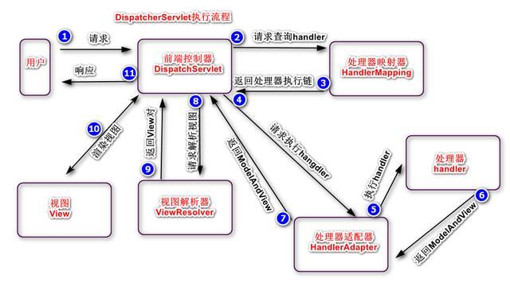
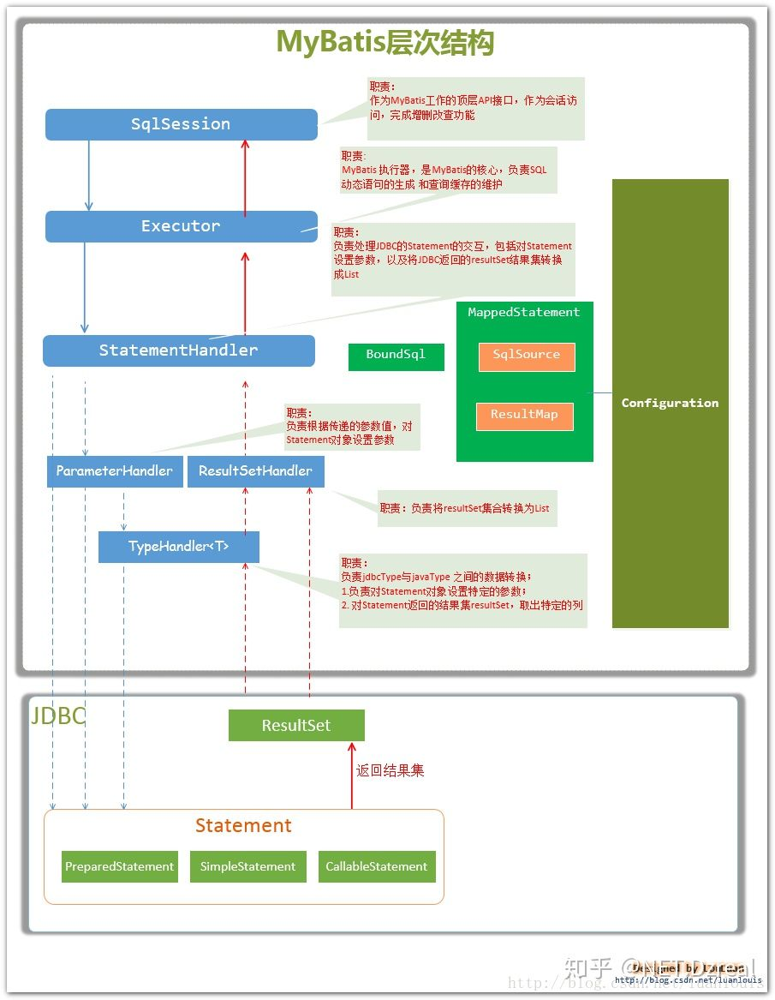

# Spring

## 核心组件

### Bean

用来包裹Object

### Context

管理Bean，维护每个Bean 的关系

###  Core

发现、建立、维护Bean 之间一些列关系所需要的工具


##  其他模块

1. DATA ACESS/INTEGRATION(数据访问/继承) 提供了与数据库交互的支持
   1. JDBC (JAVA DATABASE CONNECTIVITY)
   2. ORM (Object relational mapping)
   3. OXM(Object XML mappers)
   4. JMS(java messageing service)
   5. TRANSACTION
2. WEB -- 提供了创建WEB 引用程序的支持
   - WEB
   - web-servlet
   - web-socket
   - web-protlet
3. AOP  面向切面编程
4. Instrumentation  为类检测和类加载器的实现提供支持
5. Test 模块 使用JUnit 和 TestNG 提供测试支持
6. Messaging 、 WebSocket 为STOMP(客户端与代理消息传输协议)提供支持

## IOC

对象的声明周期和依赖关系有IOC容器来管理，作用是解耦

- BeanFactory -- Bean 组件的顶级接口，懒加载，显示语法提供资源对象，不支持国际化，不支持基于依赖的注解
- ApplicationContext --Context 组件的接口，并且继承了BeanFactory
- ClassPathXmlApplicationContext  -- 使用配置文件时
- AnnotationConfigApplicationContext


Bean 生命周期

1. 根据配置的Bean 实例化bean
2. 使用依赖注入填充属性
3. 扩展功能

## DI

通过描述依赖关系，而不是代码中直接获取资源，然后由容器通过描述把需要的资源注入到组件中。这样做是为了打造高复用的组件

依赖注入的三种方式，在spring 中 使用构造器和setter 两种方式

- 构造器传入
- setter方法复制
- 接口注入(方法中传入)

启用注解装配

```java
<context:annotation-config
```


## Bean Scope 

相关注解 

```java
@Component
@scope
```


- Singleton -  默认单例
- Prototype - 每次调用getBean 都会返回新实例
- Session
- Request


## 数据访问

1. 常用类
   - JdbcTemplate
   - SimpleJdbcTemplate
2. 异常
   - DataAccessException


## AOP

- 面向对象编程   -- 以对象为基本单元
- AOP  -- 以切面为基本单元

抽出非业务核心逻辑，作为切面，然后在业务适当的地方(切入点)加入切面-即执行切面

Spring 实现

1. 如果是普通类，则采用CGLIB (动态代理框架) 创建子类，子类中注入原始类和切面，组合的形式组织类
2. 如果接口，则使用JDK代理

```java
// after before afterReturning afterThrowing around
@Aspect
@Component
public class LoggingAspect {
    // 在执行UserService的每个方法前执行:
    @Before("execution(public * com.itranswarp.learnjava.service.UserService.*(..))")
    public void doAccessCheck() {
        System.err.println("[Before] do access check...");
    }

    // 在执行MailService的每个方法前后执行:
    @Around("execution(public * com.itranswarp.learnjava.service.MailService.*(..))")
    public Object doLogging(ProceedingJoinPoint pjp) throws Throwable {
        System.err.println("[Around] start " + pjp.getSignature());
        Object retVal = pjp.proceed();
        System.err.println("[Around] done " + pjp.getSignature());
        return retVal;
    }
}
```


# Spring MVC


DispatcherServlet 流程图




# Spring boot

## 概述

是spring 组件的一站式解决方案，降低了spring的开发难度， 简化了繁琐的配置，提供各种启动器，更块更方便搭建项目

## 优点

- 自动配置，开箱即用
- 提供了很多非业务功能。内嵌服务器、安全管理、系统监控
- 无需 xml 配置 -- 如果要使用，配合 ImportResource 注解
- 避免大量的 maven 依赖导入 -- spring-boot-starter-web

## 核心注解

SpringBootApplication , 主要组合了三个注解

- SpringBootConfiguration   组合了@Configuration注解
- EnableAutoConfiguration
- ComponentScan

## JavaConfig

使用java 代码和 Configuration 、 Bean 注解配置Bean

## 自动配置原理

核心注解：EnableAutoConfiguration /,  Configuration/ ,  conditionalOnXXX 

EnableAutoConfigruation 注解导入了AutoConfigurationImportSelect 类，其selectImports 方法会调用SpringFactoriesLoader.loadFactoryName 扫描META-INF/spring.factories 文件，这个文件里面就记录的自动配置的类，然后将他们加载的 spring 容器中 

条件注解筛选自动配置类

每一个自动配置类会结合Properties 结尾的类，读取文件属性。


# MYBATIS



```java
// 
SqlSession sqlSession=SqlSessionFactoryUtils.getSession();
UserMapper userMapper=sqlSession.getMapper(UserMapper.class);
List<User> allList=userMapper.findAll();
allList.forEach(n ->System.out.println(n));
// 1. 传统方式
// UserMaper.java
class interface UserMapper{
    list findAll();
}
// UserMapper.xml
<select id="selectUser"  resultType="User">
  SELECT * FROM user;
</select>
// 2.注解方式
@Delete("delete from message where messageid = #{messageId}")
public int deleteByMessageId(@Param("messageId")String messageid)throws SQLException;
// 动态sql
// 对应关系  @Select -- @SelectProvider 类推
@UpdateProvider(type= UserProvider, method = "updateSQL")
  
public class UserProvider {

    /**
     * udpate
     * @param UserDO userDO
     * @return
     */
    public String updateSQL(final UserDO userDO) {
        return new SQL() {
            {
                UPDATE("t_user");
                SET("gmt_modified = now()");
                if (userDO.getUserName() != null) {
                    SET("user_name = #{userName}");
                }
                WHERE("id = #{id}}");
            }
        }.toString();
    }
}
   
```


# 注解

## 类注解

- @Component  -- 注册为普通java bean组件
- @Repository  -- 注册为DAO层组件
- @Service  -- 业务层组件
- @Controller -- 控制器组件
- @Configuration -- bean 配置类

## 装配Bean 注解

- @Autowired(byType) -- 为字段、方法、构造器 注入值 。 
  - require=false 允许 bean 为null 
  - 如果要使用 name 匹配 ，需要结合注解 @Qulifier
- @Resource -- 相当于 Autowired ，只不过是 byName
  - 默认 byName，也可以指定 type 属性，或者指定 name属性

- @Bean -- 配合@Configuration 使用，生成 bean
- @Scope -- 指定 bean 的范围

## 控制器注解

- @RequestMapping -- 用于将 URL 映射到指定的处理请求的方法  GetMapping \ PostMapping \ DeleteMapping
- @PathVariable -- 提取请求参数给作为方法的参数 /blogs/1
- @RequestBody
- @RequestParam ?blogId=1


## 切面编程注解

- @Aspect
- @after
- @before
- @afterReturning
- @afterThrowing
- @arround


