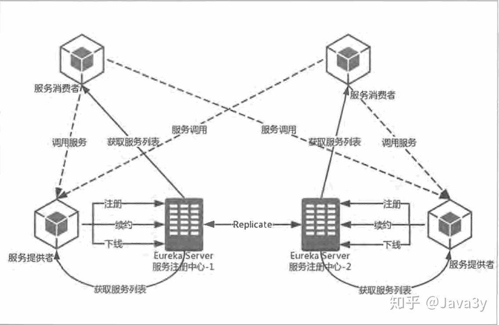

# 名词

## 集群

同一个业务部署再不同的服务器上

特点 

- 提高并发和可靠性

## 分布式

把一个业务拆分成多个子业务，然后部署再不同的服务器

特点

- 提高并发

##  微服务

相比分布式

- 微服务的颗粒度更小
- 微服务更偏向于系统设计思想
- 分布式偏向于部署的思想

特点

- 服务隔离，不会因为其他模块的升级或bug影响现有的业务
- 降低耦合，更易于单个服务的维护
- 复用性高

# SpringCloud

## 基础功能

### 服务治理 - Eureka

eureka 治理体系如下

1. eureka 服务端 -- 注册中心
   - 支持高可用配置，在eureka 治理体系中，所有节点既是客户端也是服务端，注册中心也不例外，所以通过向其他注册中心注册自己，来同步服务清单，实现高可用
   - 失效剔除，每隔一段时间，把超时没有续约的服务剔除清单
   - 自我保护，统计15 分钟之内的失败心跳是否低于85%(无效的服务/总服务数)，如果是，那么将会锁定当前的服务清单，不让剔除 -- 可能导致客户端拿到失效服务
2. eureka 客户端
   - 服务提供者或者消费者
   - 服务注册、服务续约、服务消费

### 负载均衡 

1. 客户端负载均衡(Ribbon)
2. 服务端负载均衡(nginx)

### 容错保护

由于某个服务不可用或者网络延迟导致服务负载饱和，从而导致其他服务也不可以，最终导致整个系统“雪崩”

1. 熔断机制 - Hystrix

   通过短路器故障监控，当发现一定时间内一定量的失败请求达到阈值，短路器就会打开，直接返回错误响应，而不是长时间等待，避免故障蔓延。半开机制提供了自动修复的能力。此外，Hystrix 还提供了线程池隔离 - 即不同依赖的服务使用不同的线程池，所以就算某个服务的调用出现延迟，也不会影响其他服务

   

2. 服务降级

   - 服务降级出发点针对于降低系统负荷，熔断出于可靠性考虑

   - 降级区分服务的优先级，熔断区分服务是否可用

### 声明式服务调用 - feign

为了简化服务调用，Feign 提供了一种声明式，模板化的HTTP客户端，远程服务调用就像调用本地方法一样的体验。并且它整合了ribbon 和 Hystrix

### 网关服务 Zuul

一个业务往往是由多个微服务共同完成，所以没有网关会出现

- 认证、鉴权 ， 不仅客户端单独访问微服务变得臃肿，各个微服务端也需要认证、鉴权，这造成了代码冗余

微服务网关是介于客户端和服务端的中间层，所有的请求都会经过微服务网关

- 易于监控
- 易于认证

Zuul 核心是一系列过滤器，功能包括

- 身份认证与安全
- 审查与监控 - 在边缘位置收集数据和统计结果
- 动态路由 - 动态地将请求路由到不同的后端集群
- 静态响应处理 - 在边缘位置直接建立部分响应

Zuul 和 gateway 

- 都是基于 netty 的
- 都是基于异步 IO
- gateway 更好用

### 配置中心

- 集中管理配置
- 配置自动更新
- 运行期间动态跳转 

