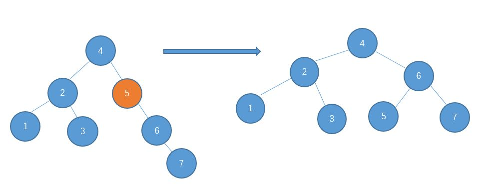
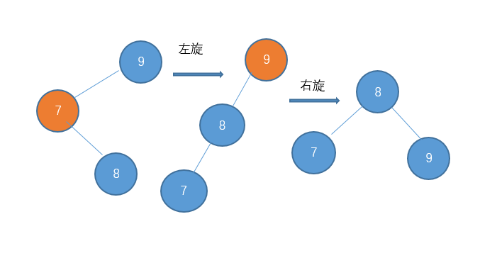
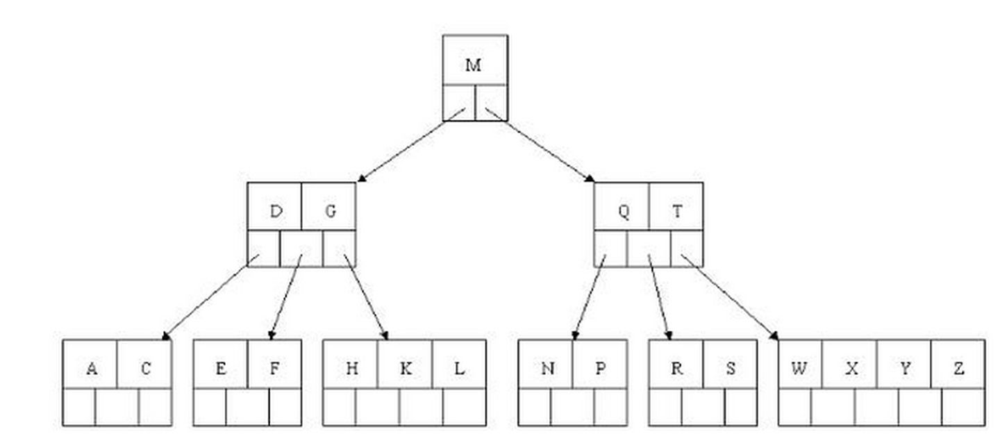

# 数据结构

## 平衡树

任意节点的左子树和右子树的高度差不超过1

查找时间复杂度 O(logn)

构建 -- 判断离根节点的节点的左右子树之差

- 左-左 -> 右旋

- 右-右 -> 左旋

  

- 右左 ->  先右旋，再左旋

- 左右 -> 先左旋，再右旋

  

## 红黑树

特点

- 所有节点要么是红色，要么是黑色

- 具有二叉查找树的特点
- 根节点黑色
- 叶子节点全为黑色的null 节点
- 相邻节点不能都为红色(可以为黑色)
- 每一个节点，其所有路径上的黑色节点数目相等

查找时间复杂度 logn

与平衡树区别: 插入、删除操作需要更少的旋转，性能更优越

## B(-) 树 与B+树

相当于多叉查找树，二叉查找树是阶数为2的B树

区别在于

- B 树的每个节都存储数据；B+只有叶子节点保持数据，非叶子节点起到索引的作用，并且叶子节点的数据使用链表相连
- B+ 非叶子节点不存储数据，所以有更多空间存储索引

# 算法

