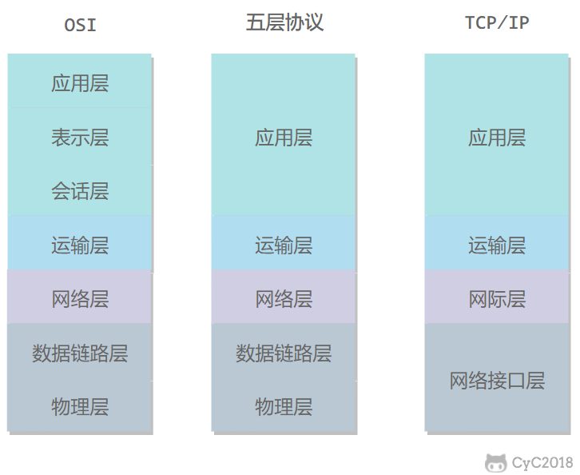
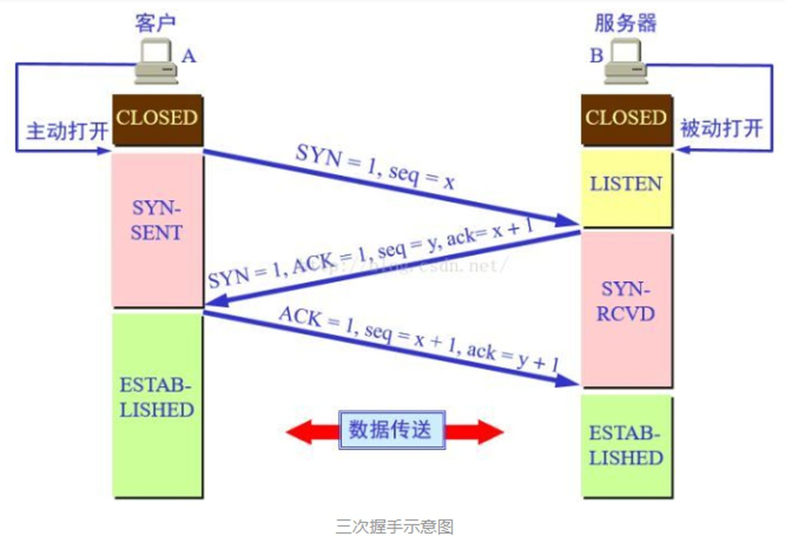
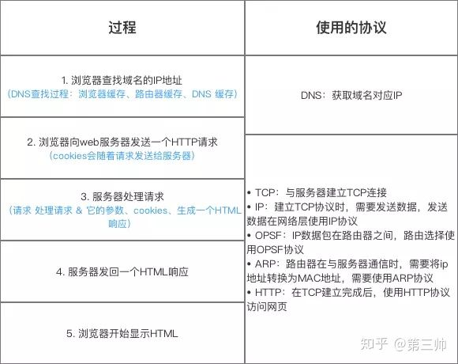
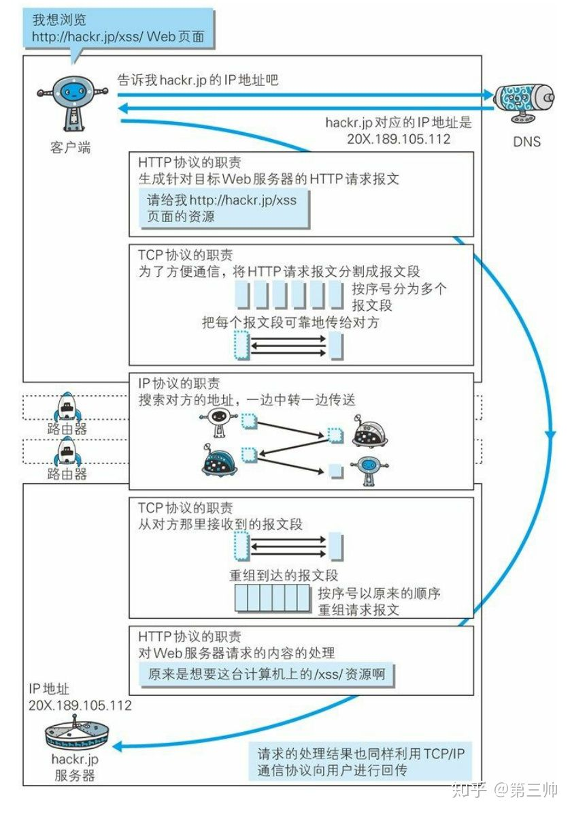

# 计算机网络

## 计算机网络体系



### 五层协议

- 应用层

  为特定的应用提供传输服务

  常用协议

  - FTP 文件传输协议
  - HTTP 超文本传输协议
  - SMTP (simple mail transfer) 邮件传输协议
  - PRC(remote procedure call) 远程过程调用

- 传输层

  建立端到端的通信

  UDP ：标头包含发送端和接受端的端口号

  TCP：相比UDP协议，需要先

- 网络层

  数据链路层中传输数据通过广播的方式局限在同一个子网，而网络层就是用来区分不同的主机是否处于同一子网，是则使用广播，否则采用路由

  常用协议

  - IP协议：定义网络地址，32位二进制。ip地址由两部分组成，网络 + 主机，而哪一部分代表主机，哪一部分代表网络由子网掩码决定。

    子网掩码：也是32位二进制组成，1代表网络部分，0代表主机部分。 例子如下

    ```
    IP 地址： 176.64.3.1 ,176.64.3.8
    子网掩码: 255.255.255.0
    从子网掩码可以得知，前24位表示网络，后8位表示主机，所以两个地址是同一个子网
    ```

    IP 数据包 -- 标头 + 数据，标头包含版本、ip地址、长度等信息

  - ARP (address resolution) 地址解析协议，ip解析mac地址。发送arp请求，由目标主机确认并返还消息

  - RARP (reverse) 反解析，通过ARP表或者缓存获取ip地址

  - ICMP (inter control message) 用于在IP主机、路由之间传输控制消息，例如主机是否可达、路由是否可用等

- 数据链路层

  以一组电信号构成一个数据包，成为帧。分为标头和数据。表头包含发送者，接收者，数据格式等说明信息。

  定位发送者、接收者是通过mac 地址。

  通过广播的方式发送数据。发送者会把数据包发送给同一子网的所有主机发送包，其他主机拿到mac地址与自身的进行比较，相同则接受

  常用协议

  - ARQ (automatic repeat-request) 自动重传请求。纠错协议之一
  - PPP (point to point ) 点对点协议

- 物理层

  规定了硬件（传输媒介）怎样传输比特流，屏蔽掉具体的传输媒介，即透明传输比特流

### OSI

- 应用层

- 表示层

  对数据进行压缩，加密和描述

- 会话层

  建立和管理会话

- 传输层

- 网络层

- 数据链路层

- 物理层

### TCP/IP

- 应用层
- 传输层
- 网际层
- 网络接口层


## TCP


### 三次握手与四次挥手



1. 客户端发送 syn=1 握手信号 + 起始序列seq = x给服务器

2. 服务器发送 syn=1 握手信号 + 起始序列seq=y + 确认信号ack=x+1(返回序列) + ACK=1(确认链接) 给客户端，并告诉客户端自己的起始序列是y

3. 客户端发送 ACK=1 + seq =x+1 + ack=y+1 给服务器 

   三次握手的目的是由于信道不可靠，于是通信双方必须就某个问题达成一致才能进行可靠的通信，而这个问题就是确认对方的起始序列，这样可以做到可靠的重传与接受，因为这样可以分辨是链接复用时是旧链接的包还是延时的包，因为seq是唯一且累加的

四次挥手


1. A发送 FIN=1 (请求端口信号) + seq=u

2. B收到数据包后发送 ACK=1(允许信号) + seq=v + ack=u+1,此时tcp处于半关闭状态

3. 当A确认要关闭链接后，发送FIN=1 + seq=2 + ack=u+1 + ACK=1

4. B收到后发送ACK=1 + seq=u+1 + ack=w+1后等待2msl(max segment lifetime) 后关闭

5. A收到后即可关闭

   需要四次挥手，原因是tcp的半关机制，就是发送FIN方不会在发送数据了，但是没有发FIN方还可以发送数据，所以需要双方都发送FIN不在发数据。需要等待2MSL是防止ack包丢失，B收不到，B收不到就会超时重传FIN包，而其时间间隔就是2MSL，2是让本链接的所以包都消失

### 拥塞控制


## 从输入url到看到页面的过程



## 各种协议与HTTP协议的关系




## HTTP

### 长连接 短链接

http1.0默认短链接，一次http请求建立一次链接，请求完链接断开 (例如，多个图片多个http请求)

http1.1 默认长连接，客户端和服务端建立链接后不会断开，保持链接，以便下一次请求。keep-alive 的时间在服务器软件中设置

http长链接实际上是tcp的长连接

### 请求报文

```
// 第一行包含请求方式，url 协议版本
// 接下来是请求报文的头部
// 空一行用来区分头部和主体
GET http://www.example.com/ HTTP/1.1
Accept: text/html,application/xhtml+xml,application/xml;q=0.9,image/webp,image/apng,*/*;q=0.8,application/signed-exchange;v=b3;q=0.9
Accept-Encoding: gzip, deflate
Accept-Language: zh-CN,zh;q=0.9,en;q=0.8
Cache-Control: max-age=0
Host: www.example.com
If-Modified-Since: Thu, 17 Oct 2019 07:18:26 GMT
If-None-Match: "3147526947+gzip"
Proxy-Connection: keep-alive
Upgrade-Insecure-Requests: 1
User-Agent: Mozilla/5.0 xxx

param1=1&param2=2
```


### 响应报文

```
// 第一行是协议版本、状态码、描述
// 接着是报文头部
// 空行后是主体
HTTP/1.1 200 OK
Age: 529651
Cache-Control: max-age=604800
Connection: keep-alive
Content-Encoding: gzip
Content-Length: 648
Content-Type: text/html; charset=UTF-8
Date: Mon, 02 Nov 2020 17:53:39 GMT
Etag: "3147526947+ident+gzip"
Expires: Mon, 09 Nov 2020 17:53:39 GMT
Keep-Alive: timeout=4
Last-Modified: Thu, 17 Oct 2019 07:18:26 GMT
Proxy-Connection: keep-alive
Server: ECS (sjc/16DF)
Vary: Accept-Encoding
X-Cache: HIT

<!doctype html>
<html>
<head>
    <title>Example Domain</title>
	// 省略... 
</body>
</html>
```


### URL

统一资源定位符，可以定位资源。URI 统一资源标识符，可以唯一标识一个资源，但不能定位

### 请求方法

- GET  获取资源

- HEAD 获取报文头部，和GET类似，但不获取主体部分，主要为了确认URL有效性

- POST 传输实体主体

- PUT 更新资源 ，更像是替换，需要发送需要修改的资源的整体

- PATCH 更新资源 ，打补丁，只需要发送修改的部分

- DEETE 删除资源

- OPTIONS 查询URL支持的方法 

  ```
  allow:PUT POST
  ```

- CONNECT  要求把通信内容经过SSL和TLS 加密后使用隧道进行传输

- TRACE 追踪路径 (会导致跨站追踪，不安全)


### COOKIE

js 可以设置cookie，也可以获取cookie

```js
document.cookie = "yummy_cookie=choco";
document.cookie = "tasty_cookie=strawberry";
console.log(document.cookie);
```


但这会导致跨站脚本攻击(XSS)，响应报文可以添加HTTPonly 避免这种情况

```
Set-Cookie: id=a3fWa; Expires=Wed, 21 Oct 2015 07:28:00 GMT; Secure; HttpOnly
```

SESSION

服务端生成session id 可以放到cookie中，如果cookie禁用，则需要使用URL重写技术将session id 作为URL参数传递

- URL重写技术 截取传入，例如 URL = host/123.html , 服务端需要把他定向为 host/main/index.html?sessionid=123

需要保证 session id 安全性

- 生成一个不容易猜到的值
- 经常更换

### GET POST

1. 参数  -- GET 参数在url中，而post参数在主体中。并不能认为 POST 安全性比GET高，因为抓包工具照样可以查看主体内容
2. 安全方法(只读)、不安全(修改)  GET是安全方法，POST 不安全方法
3. 幂等性 (一次请求与多次请求的效果一样),GET 幂等 POST不幂等。另外 安全方法是幂等的，因为不会修改服务器状态。非安全方法中，DELETE也是幂等的，因为多次执行删除的和一次执行删除的效果一样，只是响应状态码不一样


# 操作系统

## 死锁

例子：五位哲学家，五根筷子，必须拿起两根筷子，才可以进餐

### 条件

- 互斥   共享资源同时只能被一个任务占有
- 持有与等待  已经持有资源的任务需要获取被另外的任务持有的资源才能继续下一步，于是进入等待
- 不可抢占
- 循环等待 

### 解决方案

1. 破坏循环等待

   - 给资源排序，按照循序拿。(因为造成循环等待的原因是哲学家总是先右后左或者先左后右)

2. 破坏不可抢占

   - 剥夺资源

3. 破坏持有与等待

   - 给等待设置超时
   - 银行家算法

4. 银行家算法

   分配资源前，先计算资源分配的安全性，然后在进行分配

   1. 进程所需的资源 <= 系统剩余资源 
   2. 进程结束后会归坏资源

### 死锁检测与恢复

1. 一个类型一个资源的检测


检测死锁：进程、资源 各代表一个节点，并使用有向图标明其关系-- 持有/等待，使用深度优先搜索算法从一个节点开始搜索，路过的节点做上标记，如果遇到路过已经标记的节点，说明有向环存在，存在死锁

2. 死锁恢复
   - 资源抢占
   - 杀死进程
   - 回滚


