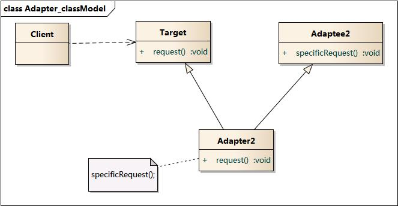

# 类图和时序图

## UML


- 实现 -- 空心三角形 + 虚线  like a
- 继承 -- 空心三角形 + 实线 表示一般与特殊的关系 is a
- 聚合 -- 空心棱形 + 实线 表示部分与整体
- 组合 -- 实心棱形 + 实线 表示部分与整体，并且不可分
- 关联 -- 箭头 + 实线 表示拥有关系
- 依赖 -- 箭头 + 虚线  A变化引起了B也变化，成B依赖A，是一种使用关系


# 创建型模式

## 工厂  *

1. 简单工厂

   通过静态方法创建对象，缺点是不符合开闭原则(需要增加新产品时要修改工厂类)

   

2. 工厂方法

   添加工厂的接口，实现接口可以创建不同的产品，符合开闭原则

   

3. 抽象工厂

   工厂方法往往一个实现创建一个对象，有时候需要一个实现创建多个对象，就称之为抽象工厂

   一个工厂可以生成多个等级的产品(产品接口不同),合起来称之为产品簇

   

## 建造者 *


## 单例 *


# 结构型模式

## 适配器 *

1. 对象适配器

   通过关联适配者对象，把功能委托给该对象完成

   

2. 类适配器

   使用多继承,在目标抽象类的方法中调用适配者的方法

   

特点:

- 将目标类和适配者类解耦
- 提高了类的复用性
- 灵活的扩展性，可以添加适配器(符合开闭原则)
- 类适配器模式需要多继承，对于java 来说有局限性

## 桥接


将抽象部分与实现部分分离，使用"桥"将两者组合，使得两部分都可以变化。

针对于有两个维度变化的系统，如要绘制具有形状和颜色的图形，形状--抽象，颜色--实现

特点

- 将抽象与实现解耦
- 扩展性好

## 装饰

## 外观 *


为多个子系统提供一个统一的访问接口，称之为外观。使得子系统更符合迪米特法则，即是的子系统的耦合达到最小

特点

- 对于外部来说，子系统的透明的，只有单一的访问方式
- 单独的使用子系统受到了限制

## 亨元

## 代理 *

# 行为型模式

## 命令


把请求或操作封装成一个对象，调用者聚合了命令对象，可以保存以用来实现撤销，恢复功能。命令接受者只需要提供不同命令对象，就可以执行不同的操作。

特点

- 将接收者和调用者解耦
- 将命令参数化，且客户端不考虑操作实现细节
- 添加新的命令符合开闭原则

```java
//创建接收者
Receiver receiver = new Receiver();
//创建命令对象，设定它的接收者
Command command = new ConcreteCommand(receiver);
//创建请求者，把命令对象设置进去
Invoker invoker = new Invoker(command);
//执行方法
invoker.action();
```


## 观察者 *


定义对象之间一对多的依赖关系，当 "一" 发生变化时，其他对象能得知，并作出相应改变 

## 中介者

在对象互相交互的比较多的系统中，使用中介者模式，把对象与对象的交互通过中介者，而不是直接引用。

特点

- 解耦

## 状态


运行一个对象的状态改变的时候改变其行为。抽象状态类定义了抽象行为，其实现就是对应了不同状态不同行为

## 策略 *


完成一个任务有多种策略，在不同条件下选择不同策略。例子: collections -环境类， comparator - 抽象策略类

## 责任链 *

为请求创建一个接收者链，然后接收者如果不能处理则传给下一个接收者。避免请求者和所有接收者者耦合在一起

## 模板方法

定义一套通用的算法，实现可以改变算法的某些特征，但不能改变其结构。


